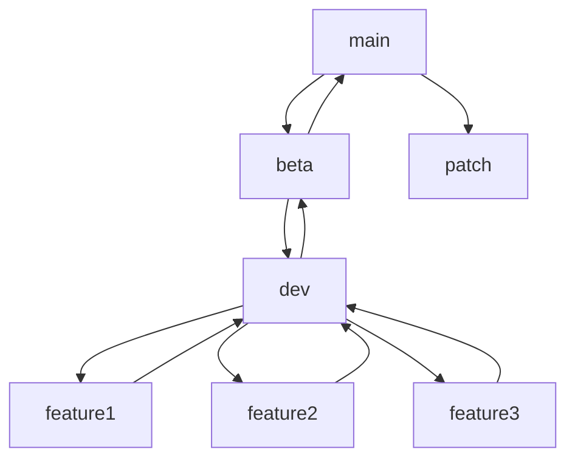

This is Beta-Branch with main and test files

# Development Operation
## Requirements
- Understand the user needs
- Requirements should be unambiguous
- Requirements should be simple, specific, concise, and comprehensive
- Requirements should be testable
- Requirements should be separate from design and implementation.
- Requirements should be attainable
- Requirements should be properly categorized
- Requirements should be prioritized
- Requirement should be traceable.

## User Story for functional requirement
    
        As a {ROLE}, I want to be able to {DO SOMETHING}.
        Given that {somthing}, When I {do something}, Then I should be able to {do something else}.

## Testing


## Testing types
### Functional Testing
- Unit Testing -> [given > action > assert]
- Integration Testing
- End to End Testing
- System Testing -> QA
- Acceptance Testing -> QA
- Smoke Testing (For large system)
  
### Non-Functional Testing
- Stress Testing
- Availability Testing
- Performance Testing (Resource utilization)
- Penetration Testing (security testing)


## Test Driven Development (TDD)
[Red -> Green -> Refactor]
- write a “single” unit test describing an aspect of the program
- run the test, which should fail because the program lacks that feature
- write “just enough” code, the simplest possible, to make the test pass
- “refactor” the code until it conforms to the simplicity criteria
- repeat, “accumulating” unit tests over time

## Behavior Driven Development (BDD)
  Behavior Driven Development is a style of testing that uses a set of behaviors to test the system. It is similar to TDD, but it is more focused on the behavior of the system rather than the implementation. It is also more focused on the user than the system.

  Behavior Driven Development can use the user story to test the system. 

  eg.

        ```As a user, I want to be able to upload bunch count videos to the system. so that the system can process the videos.```

# Codeing flow

##  Git branching



## Coding Roles
- Never edit the main branch (even admins)
- Each feature should be assigned to only one developer.
- Each developer can have one or more features
- Each developer should have at least one branch.
- 2 developers should never work on the same branch or feature.
- Merging the features should be done in the dev branch.
- Only admins can merge or edit the dev and beta branches.

